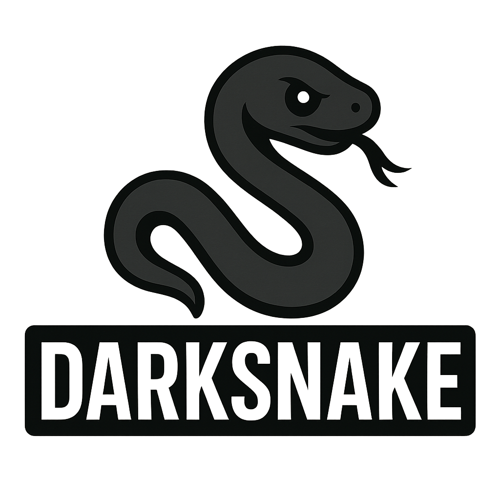

<div align="center">
  

  **A modern Snake game built with C++ and SFML**
</div>

## ✨ Features
- Modern graphics with SFML
- WASD/Arrow key controls  
- Score tracking with best score persistence
- Menu and pause functionality
- Smooth collision detection

## 📋 Requirements
- C++17+
- CMake 3.10+
- SFML 2.5+

## 🚀 Quick Start
```bash
# Install dependencies (Ubuntu/Debian)
sudo apt install cmake build-essential libsfml-dev

# Build and run
mkdir build && cd build
cmake .. && make
./Snake
```

## 🎮 Controls
- **WASD/Arrows** — Move
- **Space** — Pause
- **Enter** — Menu select
- **Escape** — Menu/Quit

## 📁 Structure
```
Snake/
├── src/           # Source files
├── include/       # Headers  
├── assets/        # Game assets
└── CMakeLists.txt # Build config
```

## 🤝 Contributing
Feel free to submit issues and pull requests!

## 📄 License
MIT License - see [LICENSE](LICENSE) file.
